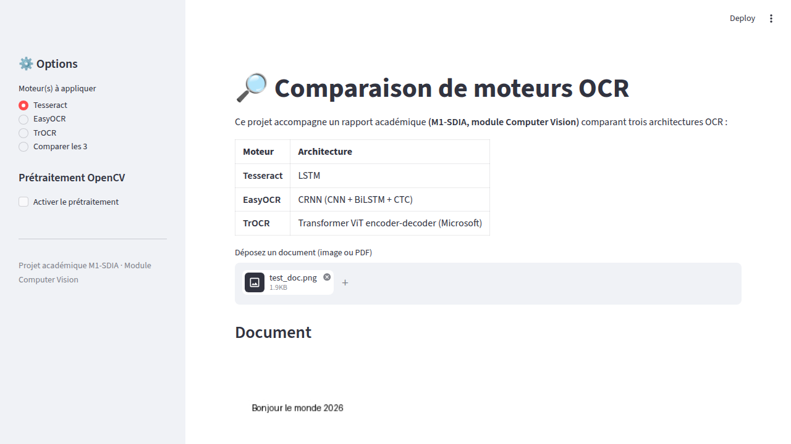
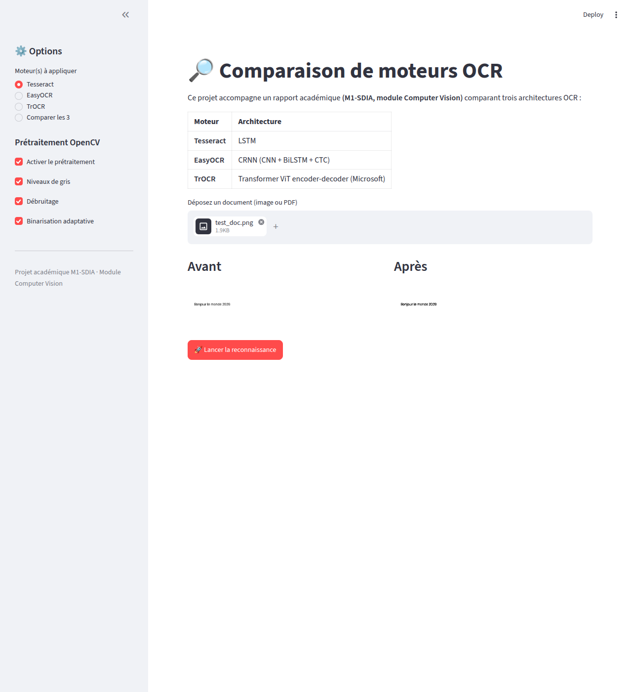
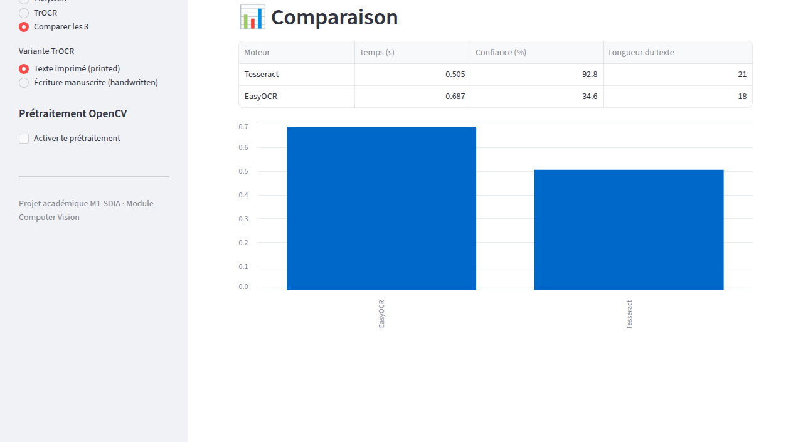

# Comparaison de moteurs OCR — Tesseract vs EasyOCR vs TrOCR

Application **Streamlit** permettant de comparer trois architectures de
reconnaissance optique de caractères (OCR) sur un même document uploadé par
l'utilisateur.

Ce projet accompagne un rapport académique **(Master 1 SDIA, module Computer
Vision)** dont l'objectif est d'étudier et de comparer expérimentalement trois
approches OCR aux architectures très différentes :

| Moteur | Architecture | Principe |
|---|---|---|
| **Tesseract** | LSTM | Moteur OCR historique (Google), pipeline classique + réseau récurrent LSTM |
| **EasyOCR** | CRNN (CNN + BiLSTM + CTC) | Extraction de features convolutives, séquençage bidirectionnel, décodage CTC |
| **TrOCR** | Transformer ViT encoder-decoder (Microsoft) | Encodeur visuel Transformer (ViT/BEiT) + décodeur texte auto-régressif |

## Fonctionnalités

- Upload d'un document image (`.png`, `.jpg`, `.jpeg`) ou **PDF** (converti en
  image via `pdf2image`/Poppler)
- Choix du ou des moteur(s) à appliquer : Tesseract, EasyOCR, TrOCR, ou
  **« Comparer les 3 »**
- Prétraitement OpenCV optionnel (niveaux de gris, débruitage, binarisation
  adaptative) avec affichage **avant / après**
- Pour TrOCR, choix de la variante pré-entraînée : `trocr-base-printed`
  (texte imprimé) ou `trocr-base-handwritten` (écriture manuscrite)
- Affichage par moteur : texte reconnu, temps d'exécution, score de confiance
  quand disponible (EasyOCR, et confiance moyenne calculée pour Tesseract)
- En mode comparaison : tableau récapitulatif + graphique du temps
  d'exécution par moteur
- Gestion propre des erreurs : binaire Tesseract absent, modèle non
  téléchargé, image illisible, dépendance manquante — l'application affiche
  un message clair au lieu de planter

## Structure du repo

```
.
├── app.py                      # Interface Streamlit principale
├── preprocessing.py             # Fonctions de prétraitement OpenCV
├── ocr_engines/
│   ├── __init__.py
│   ├── tesseract_engine.py      # Wrapper pytesseract
│   ├── easyocr_engine.py        # Wrapper easyocr (mis en cache via st.cache_resource)
│   └── trocr_engine.py          # Wrapper transformers (VisionEncoderDecoderModel + TrOCRProcessor)
├── requirements.txt
├── packages.txt                 # Dépendances système (pour déploiement Streamlit Cloud)
├── docs/screenshots/
└── README.md
```

## Installation

### 1. Dépendances système

L'application s'appuie sur deux binaires externes qui **ne sont pas
installés par pip** :

- **Tesseract OCR** (moteur `tesseract-ocr`), avec le pack de langue français
- **Poppler** (`pdftoppm`), nécessaire à `pdf2image` pour convertir un PDF en image

Sur Debian/Ubuntu :

```bash
sudo apt-get update
sudo apt-get install -y tesseract-ocr tesseract-ocr-fra poppler-utils
```

Sur macOS (Homebrew) :

```bash
brew install tesseract tesseract-lang poppler
```

Sur Windows : installer [Tesseract](https://github.com/UB-Mannheim/tesseract/wiki)
et [Poppler pour Windows](https://github.com/oschwartz10612/poppler-windows),
puis ajouter les deux au `PATH`.

### 2. Environnement Python

Python 3.10+ recommandé.

```bash
python3 -m venv .venv
source .venv/bin/activate   # sous Windows : .venv\Scripts\activate

pip install --upgrade pip
pip install -r requirements.txt
```

> **Note :** `torch` et `easyocr` représentent un téléchargement conséquent
> (plusieurs centaines de Mo). Les modèles EasyOCR et TrOCR sont eux-mêmes
> téléchargés automatiquement (via `easyocr`/`huggingface_hub`) **au premier
> lancement** de chaque moteur, puis mis en cache localement (`~/.EasyOCR`,
> `~/.cache/huggingface`) — une connexion internet est donc nécessaire la
> première fois.

### 3. Lancement

```bash
streamlit run app.py
```

L'application est accessible sur `http://localhost:8501`.

## Utilisation

1. Uploader une image ou un PDF depuis l'interface
2. (Optionnel) activer le prétraitement OpenCV dans la barre latérale
3. Choisir le(s) moteur(s) OCR à exécuter
4. Pour TrOCR, choisir la variante `printed` ou `handwritten`
5. Cliquer sur **« Lancer la reconnaissance »**
6. Consulter les résultats (texte, temps, confiance) et, en mode
   comparaison, le tableau + graphique récapitulatif

## Captures d'écran

**Upload d'un document et sélection du moteur**



**Prétraitement OpenCV — avant / après**



**Mode « Comparer les 3 » — tableau et graphique comparatif**



## Limites connues

- **TrOCR** est conçu à l'origine pour reconnaître **une ligne de texte**
  à la fois (contrairement à Tesseract/EasyOCR qui traitent nativement une
  page entière). Sur un document multi-lignes, le résultat peut donc être
  partiel — c'est un point de comparaison à part entière dans le rapport.
- TrOCR ne fournit pas nativement de score de confiance ; seuls Tesseract
  (confiance moyenne par mot) et EasyOCR (confiance native par ligne)
  affichent cette métrique.
- Les performances (temps d'exécution) mesurées dépendent fortement du
  matériel (CPU vs GPU) : l'application tourne par défaut sur CPU.

## Contexte académique

Projet réalisé dans le cadre du **Master 1 SDIA — module Computer Vision**,
pour illustrer et comparer expérimentalement trois familles d'architectures
OCR (moteur historique LSTM, CRNN, Transformer) sur des documents réels.
